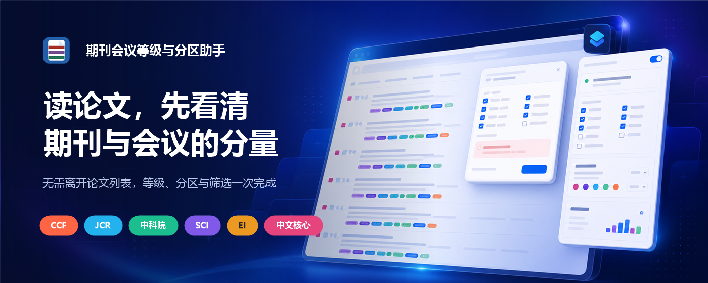

<p align=center></p>

<h1 align=center>期刊会议等级与分区助手</h1>

<p align=center>在论文标题旁直接查看期刊与会议等级。无需登录，匹配在本地完成。</p>

<p align=center>
  <a href=README.md>简体中文</a> ·
  <a href=README_EN.md>English</a> ·
  <a href=https://polarislight.github.io/Journal-Conference-Rank-Assistant/>项目主页</a> ·
  <a href=https://github.com/PolarisLight/Journal-Conference-Rank-Assistant/issues>反馈问题</a>
</p>



## 一眼看清论文出处

插件把等级标签贴在论文标题旁边，并为每个标签提供悬停说明。动态加载的新论文也会继续匹配，不需要反复打开插件。

- CCF A / B / C，未收录时显示灰色 `CCF None`
- 中科院大类分区与 Top 合并显示，例如 `中科院 1区 Top`
- JCR Q1-Q4、影响因子与 Web of Science 收录类型
- CSSCI、北大核心、Ei Compendex、新锐分区与当前预警名单
- 期刊详情包含规范名称、发行商、研究方向、ISSN、数据年份与来源
- 可拖动的筛选按钮，支持按索引、分区和等级保留论文
- 浅色、深色、跟随系统三种浮层主题
- 柔和彩、鲜明色、色盲友好三套标签色系，默认使用鲜明色

<p align=center></p>

## 收录体系

| 体系 | 插件显示内容 | 数据版本 |
| --- | --- | --- |
| CCF | A、B、C、None | 2026 |
| 中科院分区 | 1-4 区、Top | 2025 |
| 新锐分区 | 1-4 区、Top | 2026 |
| JCR | Q1-Q4、影响因子 | 2025 |
| Web of Science | SCIE、SSCI、AHCI、ESCI | 当前本地目录 |
| CSSCI | 来源期刊、扩展版 | 2025-2026 |
| 北大核心 | 中文核心期刊 | 2023 |
| Ei Compendex | 来源期刊、会议论文集 | 2026-07-09 |
| 中科院预警 | 仅当前预警名单 | 2025 |

本地目录当前包含 **35,093** 条期刊与会议记录。SCI、SCIE、SSCI、CSSCI、北大核心与 EI 是不同的收录或目录体系，本身不是另一套 Q1-Q4 分区。“SCI Q1”或“SSCI Q1”通常指 JCR 分区，因此插件只在 JCR 标签中显示 Q1-Q4。

## 支持网页

Google Scholar · DBLP 及其官方镜像 · Semantic Scholar · arXiv · OpenAlex · PubMed · 中国知网公开检索 · 万方数据公开检索

## 安装 v0.11.0

| 浏览器 | 安装包 | 说明 |
| --- | --- | --- |
| Chrome / Chromium | [下载 CRX](releases/v0.11.0/Journal-Conference-Rank-Assistant-Chrome-v0.11.0.crx) | 本地测试包。永久安装仍以 Chrome Web Store 签发为准 |
| Firefox | [下载 XPI](releases/v0.11.0/Journal-Conference-Rank-Assistant-Firefox-v0.11.0.xpi) | 未签名包只能通过 `about:debugging#/runtime/this-firefox` 临时载入 |

Firefox v0.10.1 正在 Mozilla Add-ons 公开上架审核中。审核通过后，本页会补充正式安装链接。

## 隐私与数据更新

等级匹配在浏览器本地完成。插件没有广告、统计跟踪或开发者运营的账号系统，也不会上传检索词和浏览记录。网络访问仅用于：

- 检查并下载本仓库发布的签名数据库更新
- DBLP 结果页临时不可用时调用 DBLP 官方 JSON 接口恢复结果
- 缺少发行商或研究方向时按名称或 ISSN 查询 Crossref，结果在本地缓存 30 天

插件每 7 天检查一次更新，但不会自动替换数据库。只有用户点击更新按钮后，插件才会下载加密的 `.prdb` 数据包，校验 SHA-256 和 ECDSA P-256 签名，再以当前扩展实例的 AES-GCM 密钥保存。

完整说明见 [隐私政策](PRIVACY.md)。

<details>
<summary><strong>维护者构建说明</strong></summary>

准备私有 CSV 输入后运行：

```powershell
python scripts/build_private_data.py
python scripts/merge_social_and_ei_indexes.py
python scripts/merge_xinrui_and_warning.py
python scripts/build_runtime_catalog.py
node scripts/encrypt_runtime_catalog.mjs
node scripts/build_signed_update.mjs 2026.07.13.2
```

明文输入、私钥和构建缓存均由 `.gitignore` 排除。浏览器安装包不包含 `*.private.json`。

</details>

## 数据与名称说明

基础 CCF、JCR、中科院分区、新锐 2026 与最新预警名单来自 GPL-3.0 授权的 [`hitfyd/ShowJCR`](https://github.com/hitfyd/ShowJCR) 数据导出，并保留上游版本信息。预警数据仅保留 2025 最新名单。

本项目与相关评价机构、数据库、搜索网站及出版商均无隶属或官方合作关系。等级、分区、收录与影响因子仅供检索辅助，正式评价或投稿前请以对应机构当年发布的信息为准。

<p align=center>
  <a href=https://polarislight.github.io/Journal-Conference-Rank-Assistant/>项目主页</a> ·
  <a href=PRIVACY.md>隐私政策</a> ·
  <a href=https://github.com/PolarisLight/Journal-Conference-Rank-Assistant/issues>Issues</a>
</p>
