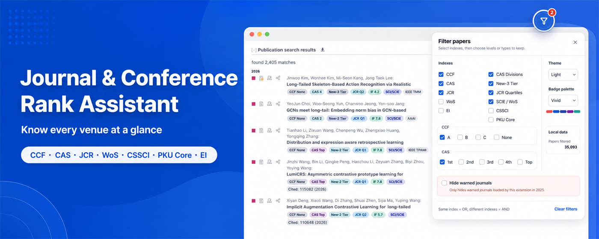

<p align=center></p>

<h1 align=center>Journal & Conference Rank Assistant</h1>

<p align=center>See journal and conference rankings beside paper titles. No sign-in, with matching performed locally.</p>

<p align=center>
  <a href=README.md>简体中文</a> ·
  <a href=README_EN.md>English</a> ·
  <a href=https://chromewebstore.google.com/detail/ibanchmlkanbhbddpejommgfhpfofifm>Install for Chrome</a> ·
  <a href=https://addons.mozilla.org/addon/journal-conf-rank-assistant>Install for Firefox</a> ·
  <a href=https://polarislight.github.io/Journal-Conference-Rank-Assistant/>Project website</a> ·
  <a href=https://polarislight.github.io/Journal-Conference-Rank-Assistant/#support>Support the project</a> ·
  <a href=https://github.com/PolarisLight/Journal-Conference-Rank-Assistant/issues>Report an issue</a>
</p>



## Understand every venue at a glance

The extension places rank badges beside paper titles and explains each badge on hover. Newly loaded results are matched without reopening the popup.

- CCF A, B, and C, with a gray `CCF None` badge for unlisted venues
- Combined CAS partition and Top status, such as `CAS Zone 1 Top`
- JCR Q1-Q4, impact factor, and Web of Science indexing types
- CSSCI, PKU Core, Ei Compendex, XinRui partitions, and the current warning list
- Venue details including canonical name, publisher, topics, ISSN, data year, and source
- A draggable page filter for keeping papers by index, partition, or rank
- Light, dark, and system-following panel themes
- Soft, vivid, and color-blind-friendly badge palettes, with vivid selected by default

<p align=center></p>

## Ranking and indexing coverage

| System | Information shown | Data version |
| --- | --- | --- |
| CCF | A, B, C, None | 2026 |
| CAS partitions | Zones 1-4, Top | 2025 |
| XinRui partitions | Zones 1-4, Top | 2026 |
| JCR | Q1-Q4, impact factor | 2025 |
| Web of Science | SCIE, SSCI, AHCI, ESCI | Current local catalog |
| CSSCI | Source and extended lists | 2025-2026 |
| PKU Core | Chinese Core Journals | 2023 |
| Ei Compendex | Source journals and proceedings | 2026-07-09 |
| CAS warning list | Current list only | 2025 |

The local catalog contains **35,093** journal and conference records. SCI, SCIE, SSCI, CSSCI, PKU Core, and Ei Compendex are different indexing or title-list systems. They do not define another Q1-Q4 scale. Phrases such as “SCI Q1” normally refer to JCR quartiles, so quartiles appear only on the JCR badge.

## Supported websites

New public search coverage: AMiner and Baidu Scholar. ResearchGate is annotated only when a public publication page exposes standard journal metadata.

Google Scholar search and author profiles · DBLP and its official mirrors · Semantic Scholar · arXiv · OpenAlex · PubMed · CNKI public search · Wanfang Data public search · major journal and publisher platforms including Nature/Springer, ScienceDirect, IEEE Xplore, ACM DL, and Wiley

## Install

| Browser | Package | Notes |
| --- | --- | --- |
| Chrome / Chromium | [Install from Chrome Web Store](https://chromewebstore.google.com/detail/ibanchmlkanbhbddpejommgfhpfofifm) | Official store edition, with permanent installation and automatic updates |
| Firefox | [Install from Firefox Add-ons](https://addons.mozilla.org/addon/journal-conf-rank-assistant) | Officially signed by Mozilla, with permanent installation and automatic updates |

The Chrome and Firefox editions are now officially available from their respective browser extension stores.

## Support the project

The extension will remain free and ad-free. If it saves you time, you can support data curation, browser compatibility testing, and ongoing maintenance through WeChat Pay or Alipay. Sponsorship does not unlock extra features and is not a purchase or subscription. Please verify the recipient name before paying.

<table>
  <tr>
    <th align="center">WeChat Pay</th>
    <th align="center">Alipay</th>
  </tr>
  <tr>
    <td align="center"></td>
    <td align="center"></td>
  </tr>
</table>

The same options are also available in the [support section on the project website](https://polarislight.github.io/Journal-Conference-Rank-Assistant/#support).

## Privacy and data updates

Ranking lookups run locally. The extension has no ads, analytics, user tracking, or developer-operated account system, and it does not upload queries or browsing history. Network access is limited to:

- checking and downloading signed database updates from this repository
- querying the official DBLP JSON API when a results page is temporarily unavailable
- querying Crossref by journal name or ISSN when metadata is missing, with results cached locally for 30 days

The extension checks for updates every seven days but never replaces the database automatically. After the user clicks the update button, it verifies the encrypted bundle with SHA-256 and ECDSA P-256, then stores it using AES-GCM.

Read the full [Privacy Policy](PRIVACY.md).

<details>
<summary><strong>Maintainer build instructions</strong></summary>

After preparing the private CSV inputs, run:

```powershell
python scripts/build_private_data.py
python scripts/merge_social_and_ei_indexes.py
python scripts/merge_xinrui_and_warning.py
python scripts/build_runtime_catalog.py
node scripts/encrypt_runtime_catalog.mjs
node scripts/build_signed_update.mjs 2026.07.13.2
```

Plaintext inputs, private signing keys, and build caches are excluded by `.gitignore`. Browser packages contain no `*.private.json` files.

</details>

## Data and naming notice

The offline inputs for base CCF, JCR, CAS partitions, XinRui 2026, and the current warning list are derived from GPL-3.0-licensed [`hitfyd/ShowJCR`](https://github.com/hitfyd/ShowJCR) exports, with upstream version metadata retained.

This project is not affiliated with or endorsed by the relevant ranking bodies, databases, search providers, or publishers. Rankings, quartiles, indexing information, and impact factors are references only. Always consult the latest official information before formal evaluation or submission decisions.

<p align=center>
  <a href=https://polarislight.github.io/Journal-Conference-Rank-Assistant/>Project website</a> ·
  <a href=PRIVACY.md>Privacy</a> ·
  <a href=https://github.com/PolarisLight/Journal-Conference-Rank-Assistant/issues>Issues</a>
</p>
